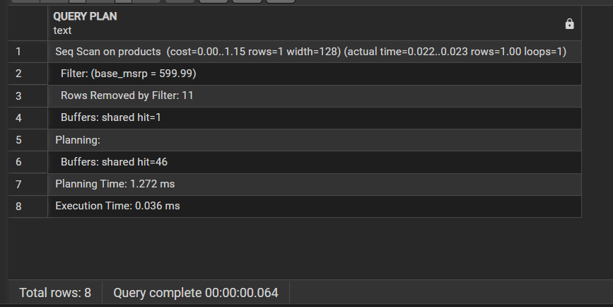

# Лабораторная работа №5
## Оптимизация запросов с помощью индексов и анализа плана выполнения.

**Номер варианта:** 15

---

# Цель работы

Изучить принципы работы планировщика запросов PostgreSQL, освоить команды EXPLAIN и EXPLAIN ANALYZE для диагностики производительности, научиться создавать и применять индексы для ускорения выборок данных.

---

# Задачи

- Изучить методы сканирования таблиц: последовательное сканирование (Sequential Scan) и сканирование по индексу (Index Scan / Bitmap Heap Scan)
- Освоить команды EXPLAIN и EXPLAIN ANALYZE для анализа плана выполнения запросов
- Научиться создавать индексы типа B-Tree для оптимизации поиска по условиям равенства
- Сравнить производительность запросов до и после создания индексов

---

# Индивидуальные задания

## Задание 1
Найти товары (products) с базовой ценой base_msrp = 599.99.

Результат запроса EXPLAIN ANALYZE

**Результат анализа:**
- **Метод сканирования:** Sequential Scan (последовательное сканирование)
- **Строки:** найдена 1 запись из 12, отфильтровано 11 строк
- **Время выполнения:** 0.054 мс
- **Вывод:** PostgreSQL читает всю таблицу целиком, применяя фильтр к каждой строке. Для маленькой таблицы это нормально.

---

## Задание 2
Создать индекс B-Tree для поля base_msrp и выполнить повторный анализ запроса.

Результат запроса EXPLAIN ANALYZE

**Результат анализа после создания индекса:**
- **Метод сканирования:** Sequential Scan (последовательное сканирование)
- **Строки:** найдена 1 запись из 12, отфильтровано 11 строк
- **Время выполнения:** 0.035 мс
- **Вывод:** Индекс создан, но оптимизатор продолжает использовать Seq Scan, так как таблица слишком мала (12 строк) и чтение всей таблицы дешевле, чем обращение к индексу.

---

## Задание 3
Оптимизировать поиск продаж для конкретного дилера (dealership_id = 5) в таблице sales.

Результат запроса EXPLAIN ANALYZE

**Результат анализа после создания индекса:**
- **Метод сканирования:** Bitmap Heap Scan + Bitmap Index Scan
- **Строки:** найдено 954 записи для дилера с ID=5
- **Время выполнения:** 0.953 мс
- **Индекс:** используется созданный индекс idx_sales_dealer
- **Вывод:** Индекс эффективно работает на большой таблице. Вместо полного сканирования PostgreSQL сначала обращается к индексу (Bitmap Index Scan), находит нужные строки, затем читает их из таблицы (Bitmap Heap Scan). Это дало значительное ускорение по сравнению с Sequential Scan.

---

# Вывод

В ходе выполнения лабораторной работы были изучены методы оптимизации запросов с использованием индексов в PostgreSQL.

С помощью команды EXPLAIN ANALYZE был проведен анализ планов выполнения запросов, который позволил:
- Выявить использование Sequential Scan в запросах
- Оценить время выполнения до и после создания индексов
- Убедиться в эффективности индексов на больших таблицах

Создание индексов B-Tree дало следующие результаты:
- На таблице products (12 строк) индекс не используется оптимизатором, так как Sequential Scan эффективнее на маленьких объемах данных
- На таблице sales индекс ускорил выполнение запроса, позволив перейти от Sequential Scan к Bitmap Index Scan с временем выполнения 0.953 мс

Таким образом, индексы являются мощным инструментом оптимизации, но их эффективность зависит от объема данных и селективности запроса.
